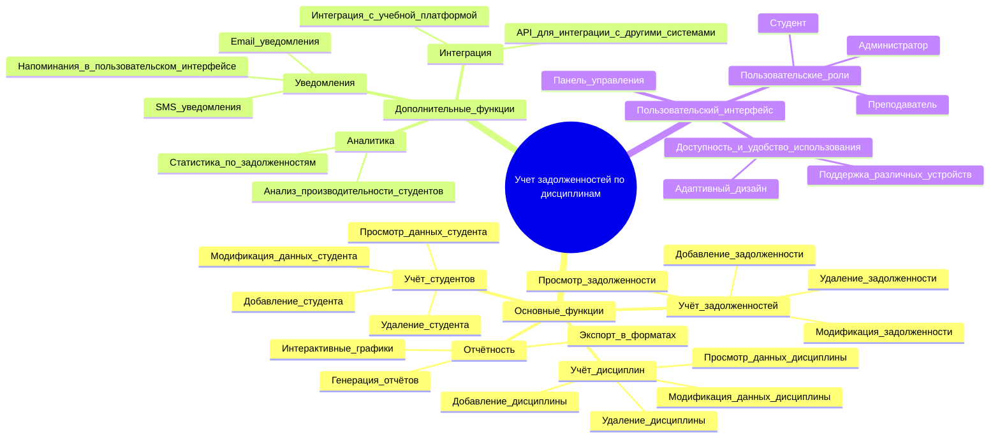

```mermaid
mindmap
  root((Учет задолженностей по дисциплинам))
    Основные_функции
      Учёт_задолженностей
        Добавление_задолженности
        Модификация_задолженности
        Удаление_задолженности
        Просмотр_задолженности
      Учёт_студентов
        Добавление_студента
        Модификация_данных_студента
        Удаление_студента
        Просмотр_данных_студента
      Учёт_дисциплин
        Добавление_дисциплины
        Модификация_данных_дисциплины
        Удаление_дисциплины
        Просмотр_данных_дисциплины
      Отчётность
        Генерация_отчётов
        Экспорт_в_форматах
        Интерактивные_графики
    Дополнительные_функции
      Уведомления
        Email_уведомления
        SMS_уведомления
        Напоминания_в_пользовательском_интерфейсе
      Аналитика
        Статистика_по_задолженностям
        Анализ_производительности_студентов
      Интеграция
        API_для_интеграции_с_другими_системами
        Интеграция_с_учебной_платформой
    Пользовательский_интерфейс
      Панель_управления
      Пользовательские_роли
        Администратор
        Преподаватель
        Студент
      Доступность_и_удобство_использования
        Адаптивный_дизайн
        Поддержка_различных_устройств
```