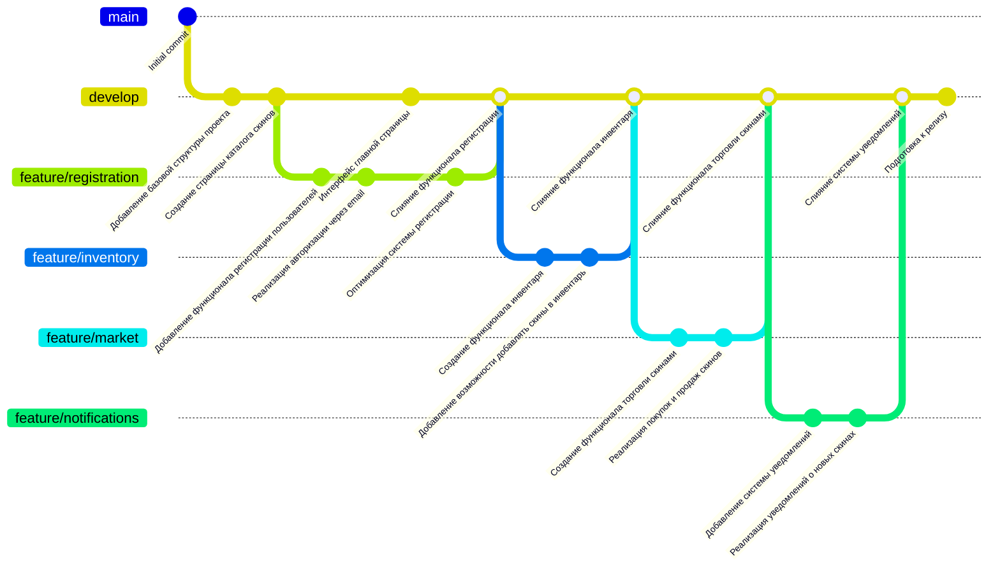

```mermaid
gitGraph
    commit id: "Initial commit"
    branch develop
    commit id: "Добавление базовой структуры проекта"
    commit id: "Создание страницы каталога скинов"

    branch feature/registration
    commit id: "Добавление функционала регистрации пользователей"
    commit id: "Реализация авторизации через email"
    checkout develop
    commit id: "Интерфейс главной страницы"

    checkout feature/registration
    commit id: "Оптимизация системы регистрации"
    checkout develop

    merge feature/registration id: "Слияние функционала регистрации"

    branch feature/inventory
    commit id: "Создание функционала инвентаря"
    commit id: "Добавление возможности добавлять скины в инвентарь"
    checkout develop

    merge feature/inventory id: "Слияние функционала инвентаря"

    branch feature/market
    commit id: "Создание функционала торговли скинами"
    commit id: "Реализация покупок и продаж скинов"
    checkout develop

    merge feature/market id: "Слияние функционала торговли скинами"

    branch feature/notifications
    commit id: "Добавление системы уведомлений"
    commit id: "Реализация уведомлений о новых скинах"
    checkout develop

    merge feature/notifications id: "Слияние системы уведомлений"

    commit id: "Подготовка к релизу"
```