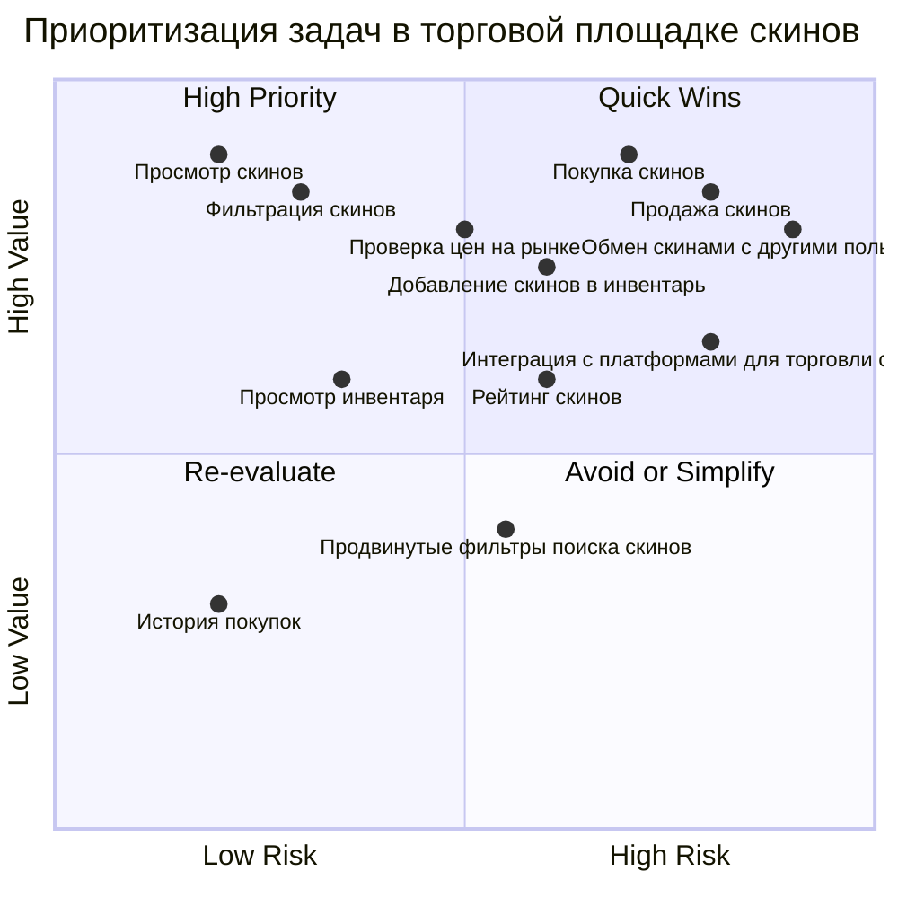

```mermaid
quadrantChart
    title Приоритизация задач в торговой площадке скинов
    x-axis Low Risk --> High Risk
    y-axis Low Value --> High Value
    quadrant-1 Quick Wins
    quadrant-2 High Priority
    quadrant-3 Re-evaluate
    quadrant-4 Avoid or Simplify
    "Просмотр скинов": [0.2, 0.9]
    "Фильтрация скинов": [0.3, 0.85]
    "Просмотр инвентаря": [0.35, 0.6]
    "Проверка цен на рынке": [0.5, 0.8]
    "История покупок": [0.2, 0.3]
    
    "Покупка скинов": [0.7, 0.9]
    "Продажа скинов": [0.8, 0.85]
    "Обмен скинами с другими пользователями": [0.9, 0.8]
    "Добавление скинов в инвентарь": [0.6, 0.75]
    
    "Рейтинг скинов": [0.6, 0.6]
    "Продвинутые фильтры поиска скинов": [0.55, 0.4]
    "Интеграция с платформами для торговли скинами": [0.8, 0.65]
```